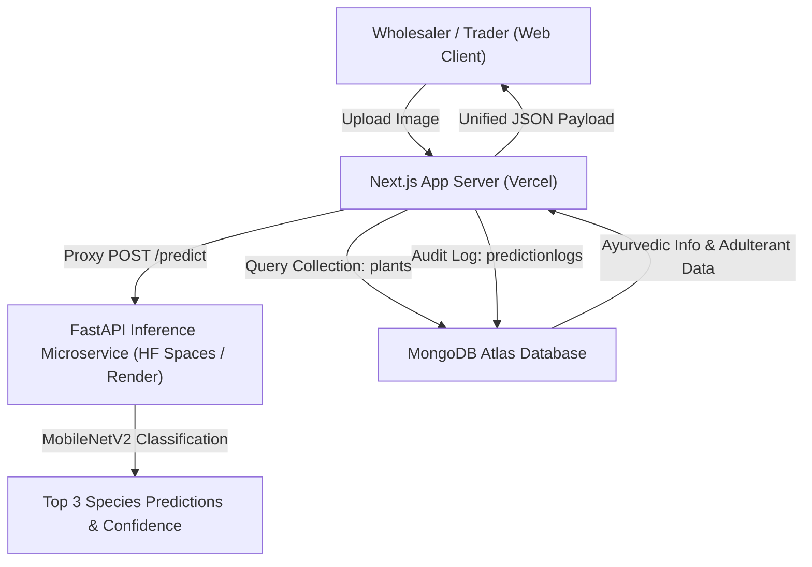

# AYUSH AI Medicinal Plant & Raw Material Identification Platform

> **Smart India Hackathon Project (SIH260170 — Ministry of AYUSH)**  
> An AI-powered neural vision and pharmacopoeia system designed to identify Indian medicinal plants/raw materials from images, showing Ayurvedic names, medicinal uses, and known commercial adulterants/substitutes to prevent supply chain misidentification.

---

## 🌿 Tech Stack

- **ML Inference Microservice**: Python, FastAPI, TensorFlow 2.16 (MobileNetV2 Transfer Learning), Pillow, Scikit-learn.
- **App & API Backend**: Next.js 14 (App Router, Serverless API Routes), TypeScript, Mongoose.
- **Database**: MongoDB Atlas (Cloud NoSQL Database).
- **Frontend UI & Graphics**: React 18, React Three Fiber (R3F), Three.js, GSAP (ScrollTrigger), Framer Motion, TailwindCSS (Botanical Dark Mode Theme).
- **Deployment**: Vercel (Next.js Frontend) + Hugging Face Spaces / Render (FastAPI Docker Container) + MongoDB Atlas.

---

## 🏗️ Architecture Diagram



---

## 📁 Repository Structure

```
ayush-plant-app/
├── app/
│   ├── layout.tsx                  # Root Layout & Font Setup
│   ├── page.tsx                    # Main 3D Scroll-Driven Page
│   ├── globals.css                 # Botanical CSS Tokens & Animations
│   └── api/
│       ├── identify/route.ts       # Image Proxy & Mongo Join Route
│       ├── analytics/route.ts      # Supply Chain Insights & Audit API
│       └── plants/[species]/route.ts# Species Search Route
├── components/
│   ├── 3d/
│   │   ├── BotanicalScene.tsx      # R3F Canvas Container
│   │   └── BotanicalParticles.tsx  # Procedural 3D Particle Cloud
│   ├── ui/
│   │   ├── Header.tsx              # Navigation Bar
│   │   ├── ProblemSection.tsx      # AYUSH Crisis Statement Cards
│   │   ├── UploadSection.tsx       # Drag & Drop Uploader with Laser Scan
│   │   ├── ResultCard.tsx          # Ayurvedic Info & Adulterants Banner
│   │   └── Footer.tsx              # Hackathon Footer
│   └── hooks/
│       └── useMousePosition.ts     # Parallax Cursor Hook
├── lib/
│   └── mongodb.ts                  # Serverless Mongoose Connector
├── models/
│   ├── Plant.ts                    # Plant Schema with Adulterants & Substitutes
│   └── PredictionLog.ts            # Audit Log Schema
├── scripts/
│   └── seed.mjs                    # MongoDB Seeding Script
├── .env.local                      # Environment Variables
├── package.json
└── README.md
```

---

## 🚀 Local Development Setup

### 1. ML Backend Setup (FastAPI)
```bash
cd ayush-plant-ml-api
pip install -r requirements.txt
python train.py                 # Downloads dataset and exports medicinal_plant_model.h5
uvicorn main:app --reload --port 8000
```

### 2. Frontend & Database Setup (Next.js + MongoDB)
```bash
cd ayush-plant-app
npm install

# Seed MongoDB with Ayurvedic plant knowledge base
npm run seed

# Run Next.js Development Server
npm run dev
```

Visit `http://localhost:3000` in your browser.

---

## 📡 API Reference

### `POST /api/identify`
Accepts image upload (`multipart/form-data`) under field name `file`. Returns species identification, top-3 candidates, confidence score, and matched Ayurvedic plant information with known adulterants.

### `GET /api/analytics`
Returns aggregate supply chain statistics, total scans performed, low-confidence warning rate, and top queried species for auditor reporting.
